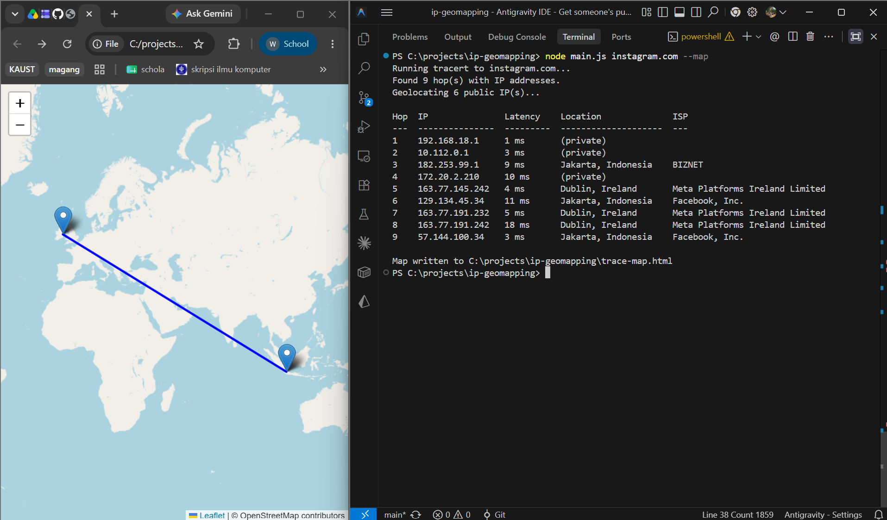

# Map-My-Hop

Runs a traceroute to a host, geolocates each hop's public IP, prints a table, and optionally renders the route on an interactive map.

## Requirements

- Windows (uses the built-in `tracert` command and opens maps via `start chrome`)
- [Node.js](https://nodejs.org/) 18 or later (needs native `fetch`)
- Google Chrome installed (only needed for `--map`)
- Internet access, for:
  - [ip-api.com](https://ip-api.com/) (geolocation lookups)
  - unpkg.com and openstreetmap.org (Leaflet map tiles/assets, only needed for `--map`)

## Running locally

```bash
node main.js <host> [--map]
```

Examples:

```bash
node main.js google.com
node main.js 1.1.1.1 --map
```

- Without `--map`, results print as a table in the terminal.
- With `--map`, a `trace-map.html` file is written to the project root and opened in Chrome, showing each hop as a marker on a world map connected by a line.

## Example Result



## Limitations

- **Windows-only**: relies on `tracert -d` and `start chrome`; will not run as-is on macOS/Linux.
- **Free-tier geolocation**: uses ip-api.com's free endpoint (plain HTTP, not HTTPS), which is rate-limited (45 requests/minute per IP) and can be inaccurate, especially for mobile/CGNAT or VPN-routed IPs.
- **Private/reserved IPs are skipped**: hops on private ranges (10.x, 172.16-31.x, 192.168.x, 127.x, 169.254.x) are shown as `(private)` and never geolocated.
- **No retry/backoff**: a failed or rate-limited geolocation request just logs a warning and leaves those hops unresolved for that run.
- **No authentication or persistence**: this is a local CLI tool with no server component, database, or stored history between runs.
- **Requires outbound internet access** to both the target host (for traceroute) and ip-api.com/CDN endpoints (for geolocation and mapping); it will not work in fully offline or heavily firewalled environments.
